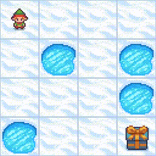
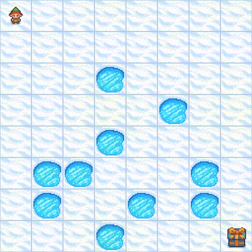
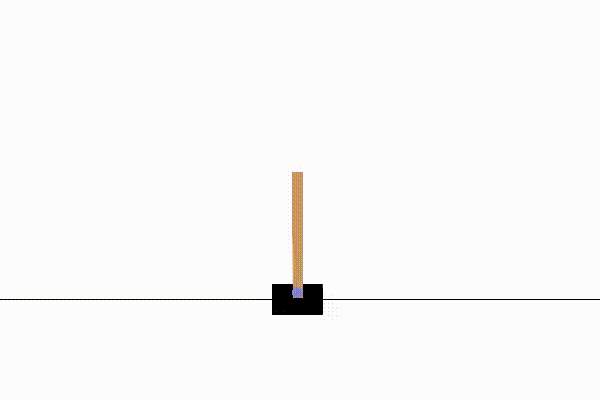
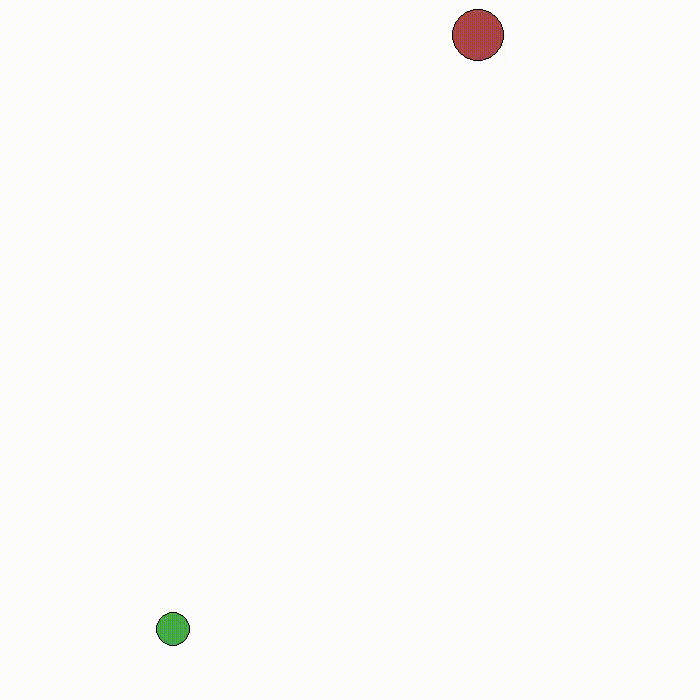
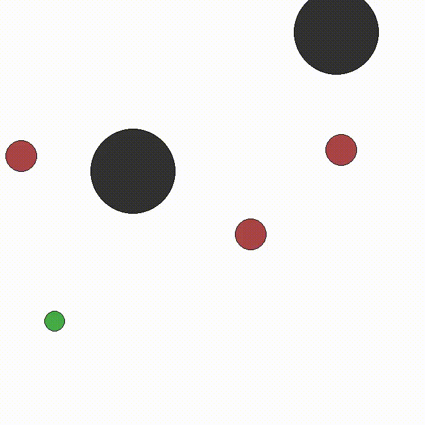

# Reinforcement Learning Odyssey

## Welcome

Welcome to my Reinforcement Learning Odyssey, this is my comprehensive repository dedicated to exploring and mastering reinforcement learning (RL) through various environments including
-  https://gymnasium.farama.org/
-  https://minigrid.farama.org
-  https://pettingzoo.farama.org
and more to come! 

## Environment
All the following programs was done in python version 3.8.

## Examples
Here are some examples of the results

### Frozen Lake
| Frozen Lake w/ Q-Learning    4x4         | Frozen Lake w/ Q-Learning 8x8            |
| ---------------------------------------- | ---------------------------------------- |
|                                          |
|  |  |

### Cart Poole
| Cart Poole w/ Q-Learning                      | Training Reward                   |
| --------------------------------------------- | --------------------------------- |
|  |  |

### Multi Particle Environments (MPE) with MADDPG
| Simple Tag with one Good, one Adversary                                     | Simple Tag with one Good, two Adversary, two Obstacle                       |
| --------------------------------------------------------------------------- | --------------------------------------------------------------------------- |
|  |  |

