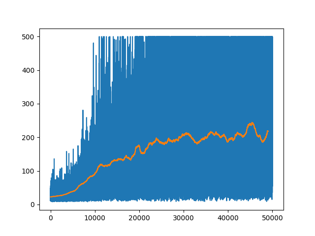

# Reinforcement Learning Odyssey

## Welcome

Welcome to my Reinforcement Learning Odyssey, this is my comprehensive repository dedicated to exploring and mastering reinforcement learning (RL) through various environments including
-  https://gymnasium.farama.org/
-  https://minigrid.farama.org
-  https://pettingzoo.farama.org
and more to come! 

## Environment
All the following programs was done in python version 3.8.

## Examples
Here are some examples of the results

### Frozen Lake
| Frozen Lake w/ Q-Learning |     |
| ------------------------- | --- |
|                           |     |
### Frozen Lake
| Frozen Lake w/ Q-Learning                  |                                                                                                 |
| ------------------------------------------ | ----------------------------------------------------------------------------------------------- |
|  | <video controls> <source src="./FrozenLake/videos/8x8-episode-0.mp4" type="video/mp4"> </video> |

### Cart Poole
| Cart Poole w/ Q-Learning                                                                           | Training Reward                   |
| -------------------------------------------------------------------------------------------------- | --------------------------------- |
| <video controls> <source src="./CartPole/videos/cartpole-episode-0.mp4" type="video/mp4"> </video> |  |

### Multi Particle Environments (MPE) with MADDPG
| Simple Tag with one Good, one Adversary                                                                                          | Simple Tag with one Good, two Adversary, two Obstacle                                                                            |
| -------------------------------------------------------------------------------------------------------------------------------- | -------------------------------------------------------------------------------------------------------------------------------- |
| <video controls> <source src="./MLE/results/simple_tag_v3/run_3/mpe_good_1_adv_1_obs_0-episode-0.mp4" type="video/mp4"> </video> | <video controls> <source src="./MLE/results/simple_tag_v3/run_4/mpe_good_1_adv_3_obs_2-episode-0.mp4" type="video/mp4"> </video> |

